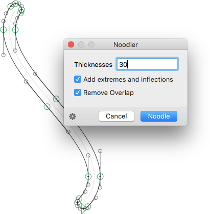

# Noodler.glyphsFilter

This is a plugin for the [Glyphs font editor](http://glyphsapp.com/) by Georg Seifert.
It turns monolines of all selected glyphs into noodles. After installation, it will add the menu item *Filter > Noodler*. You can set a keyboard shortcut in System Preferences.

### Installation

1. Download the complete ZIP file and unpack it, or clone the repository.
2. Double click the .glyphsFilter file. Confirm the dialog that appears in Glyphs.
3. Restart Glyphs

### Usage Instructions

1. Open a glyph in Edit View, or select any number of glyphs in Font or Edit View.
2. Use *Filter > Noodler* to insert inflection nodes.

Alternatively, you can also use it as a custom parameter:

	Property: Filter
	Value: Noodler;<noodlethickness>

... where `<noodlethickness>` is the thickness of your noodle, e.g.:
	
	Property: Filter
	Value: Noodler;20

### License

Copyright 2014 Rainer Erich Scheichelbauer (@mekkablue).
Based on sample code by Georg Seifert (@schriftgestalt).

Licensed under the Apache License, Version 2.0 (the "License");
you may not use this file except in compliance with the License.
You may obtain a copy of the License at

http://www.apache.org/licenses/LICENSE-2.0

See the License file included in this repository for further details.
