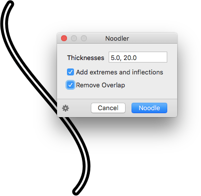

# Noodler.glyphsFilter

This is a plugin for the [Glyphs font editor](http://glyphsapp.com/) by Georg Seifert.
It turns monolines of all selected glyphs into noodles. After installation, it will add the menu item *Filter > Noodler*. You can set a keyboard shortcut in System Preferences.

### Installation

1. Download the complete ZIP file and unpack it, or clone the repository.
2. Double click the .glyphsFilter file. Confirm the dialog that appears in Glyphs.
3. Restart Glyphs.

### Usage Instructions

1. Open a glyph in Edit View, or select any number of glyphs in Font or Edit View.
2. Use *Filter > Noodler* to noodle your lines.

Alternatively, you can also use it as a custom parameter:

	Property: Filter
	Value: Noodler; <noodlethickness>; <extremesAndInflection>; <removeOverlap>

... where `<noodlethickness>` is the thickness of your noodle, `<extremesAndInflection>` and `<removeOverlap>` are `1` for yes and `0` for no, e.g.:

	Property: Filter
	Value: Noodler;20;1;1

At the end of the parameter value, you can hang `exclude:` or `include:`, followed by a comma-separated list of glyph names. This will apply the filter only to the included glyphs, or the glyphs not excluded, respectively. The space around the semicolons is optional.

### Inline Noodling

You can have inline noodles by adding any number of noodle values, separated by commas:

It also works as a custom parameter:

	Property: Filter
	Value: Noodler; <noodlethickness>,<noodlethickness>,<noodlethickness>; <extremesAndInflection>

E.g.:

	Property: Filter
	Value: Noodler;10,30;1

The `<removeOverlap>` value defaults to `1` if you leave it out.

### Copy and Paste the Custom Parameter

Via the gear menu in the lower left corner of the window, you can copy a custom parameter for the current settings into your clipboard:

Afterwards, you can go to *File > Font Info > Instances* (Cmd-I), select an instance in the sidebar of the window, click in the *Custom Parameters* field in order to set the focus, and simply paste it (Cmd-V).

### Requirements

The plugin needs Glyphs 1.4.3 or higher, running on OS X 10.7 or later. I can only test it in current OS versions, and I assume it will not work in versions of Mac OS X older than 10.7.

### License

Copyright 2014 Rainer Erich Scheichelbauer (@mekkablue).
Based on sample code by Georg Seifert (@schriftgestalt).

Licensed under the Apache License, Version 2.0 (the "License");
you may not use this file except in compliance with the License.
You may obtain a copy of the License at

http://www.apache.org/licenses/LICENSE-2.0

See the License file included in this repository for further details.
